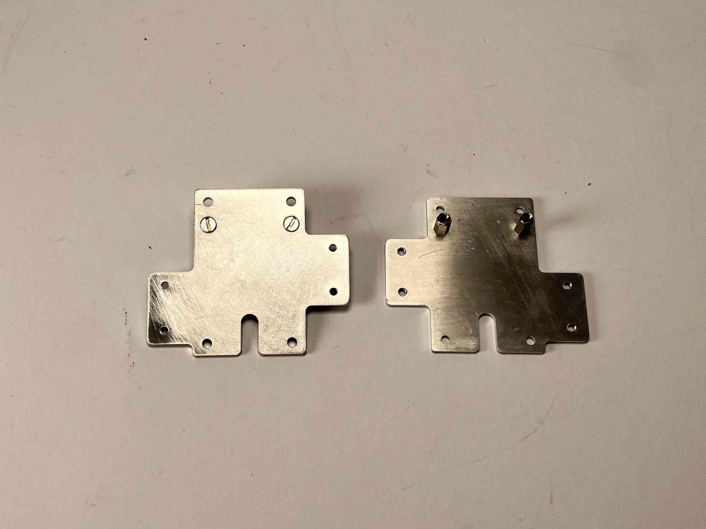

################################
X Carriage and Toolchanger
################################

For the X-carriage assembly you will need:

- 2x 28 mm standoffs
- 2x Machined X Carriage Plate
- 1x 3D printed Top Block
- 1x Tensioning System (8 parts)
- 4x 8mm standoffs with inner thread
- 4x 6mm standoffs with one outer and one inner thread
- 2x M3x40 caphead screw
- 4x M3 locking nut
- 4x M3x6 countersunk screw
- 6x M3x6 caphead screw
- 2x M3x10 countersunk screw
- 4x M3x16 caphead screw
- 1x microswitch endstop

| First, attach the four 8mm inner thread standoffs to the plates by attaching the four M3x6 countersunk screws as shown.

| 

| 

| 

----------------------------

| Next, attach the two plates together using the 28 mm standoffs in between the plates, and the other four 8 mm spacers to hold them in place. 

| 

| 

| 

----------------------------

| Make sure the parts of the tensioning system slot into each other and slide all the way in.   

| 

|

| 

| 

----------------------------

| Insert two m3 locking nuts into the tensioner slide as shown.

|

| 

| 

| 

----------------------------

| Attach the brackets to one side of the assembly and fasten using four M3x6 countersunk screws.

| 

| 

| 

----------------------------

| Insert the two M3x10 countersunk screws. These are later used for tensioning the belts.

| 

| 

| 

----------------------------

| Attach the top block to the X carriage using four M3x16 caphead screws.

| 

| 

| 

----------------------------

| Attach the microswitch to the top block using two M3x6 caphead screws.

| 

| 

| 

----------------------------

Attach the assembly to the topblock, using the two M3x40 caphead screws and two M3 locking nuts.

| Insert the belts into the sliders.

| 

| 

| 

----------------------------

Insert the sliders into the tensioner blocks while turning the tensioning screws, just until the threads catch. Pretension the belts and clamp them in place on the front part of the carriage by attaching the tensioning plates with four M3x6 caphead screws. Finish tensioning by pulling in the tensioning slides using the M3x10 screws.

For the tool changer assembly, you will need the parts provided with the E3D tool changer, the machined shaft, and the printed tool changer cover. Please follow the installation guide "08 - Toolchanger Toolhead Installation" found `on the E3D website <https://e3d-online.zendesk.com/hc/en-us/articles/4402640504081-ToolChanger-Motion-System-Assembly-Guides>`_ up until step 36. 
