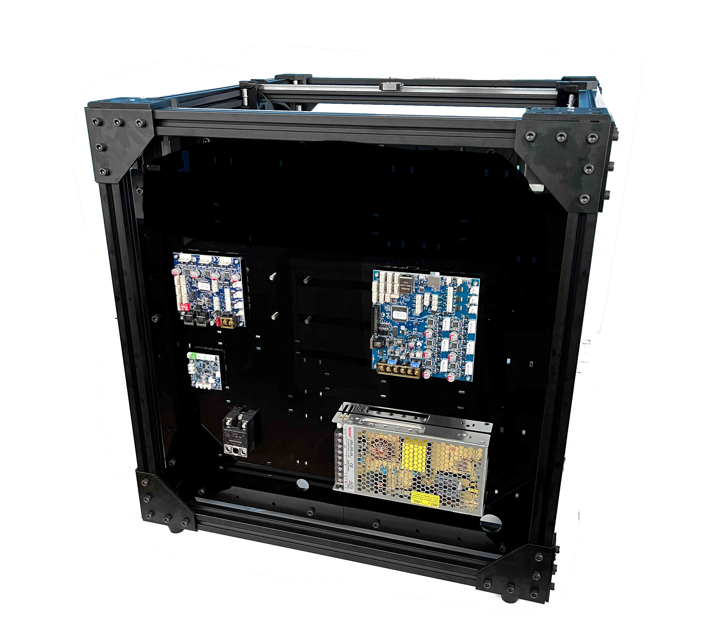
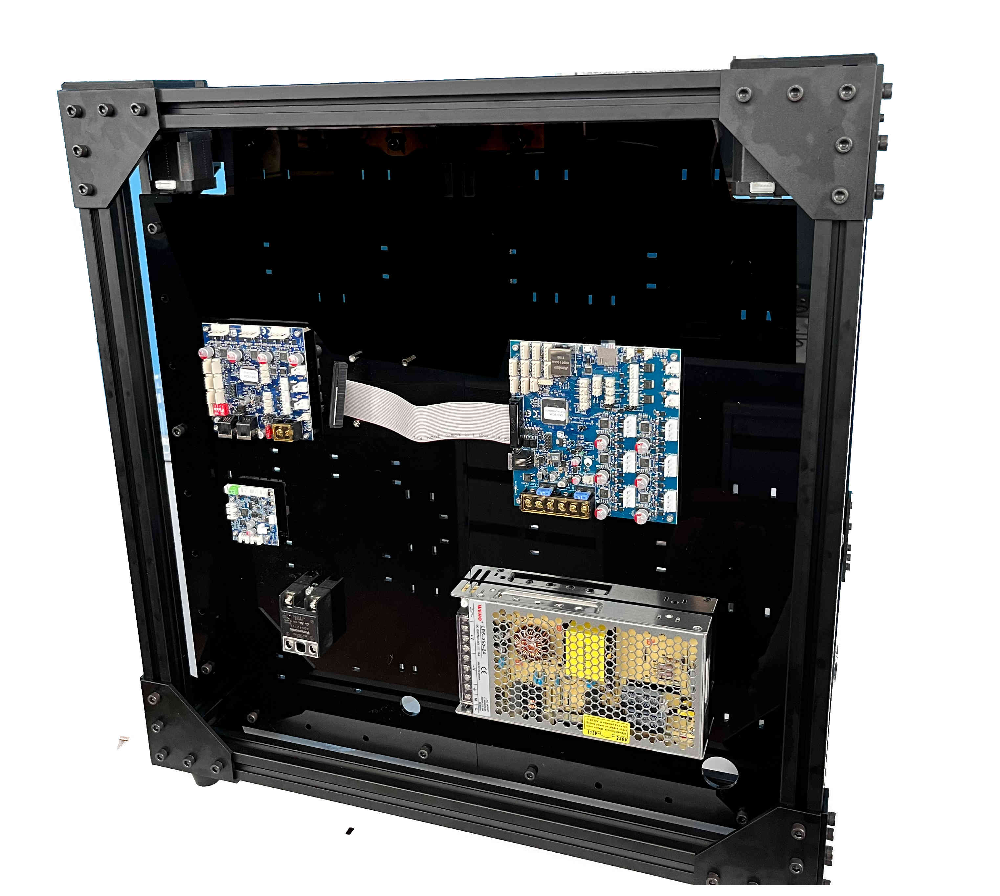
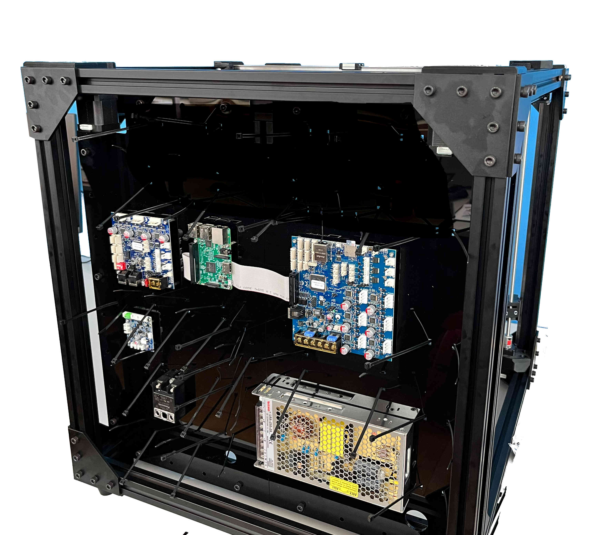
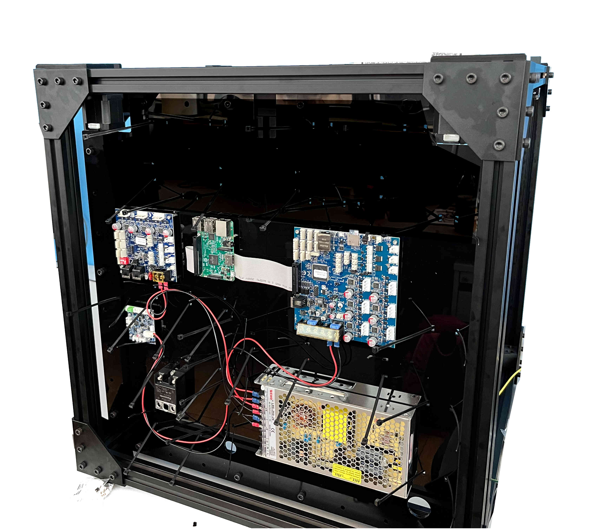
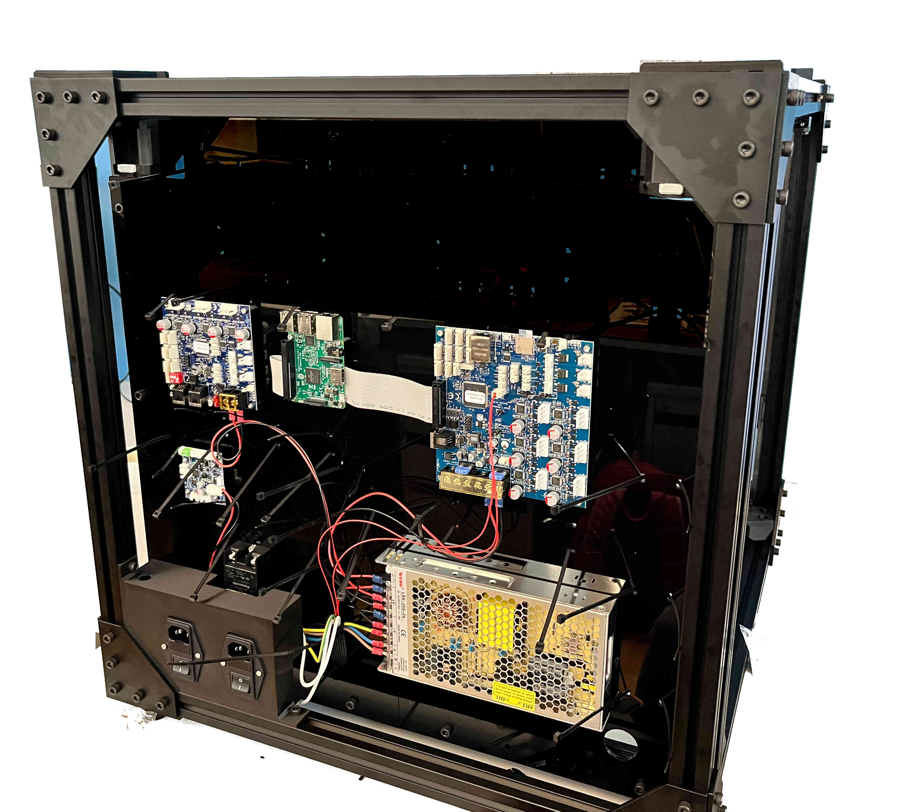
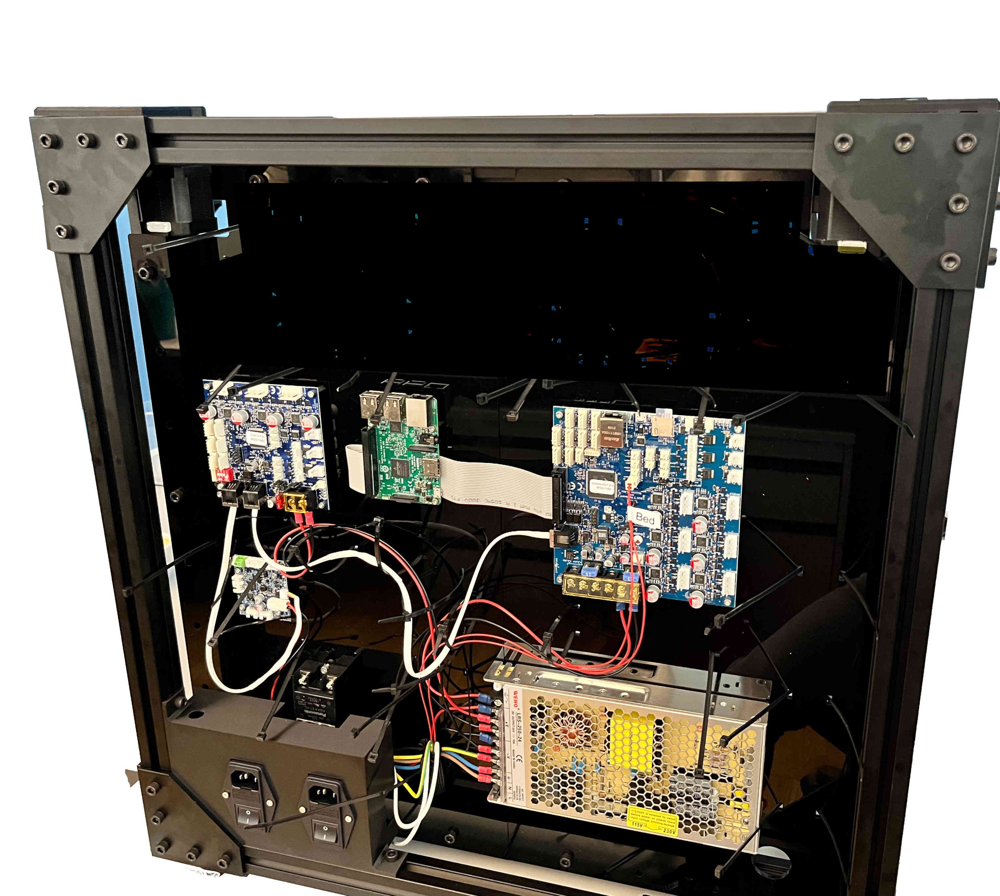
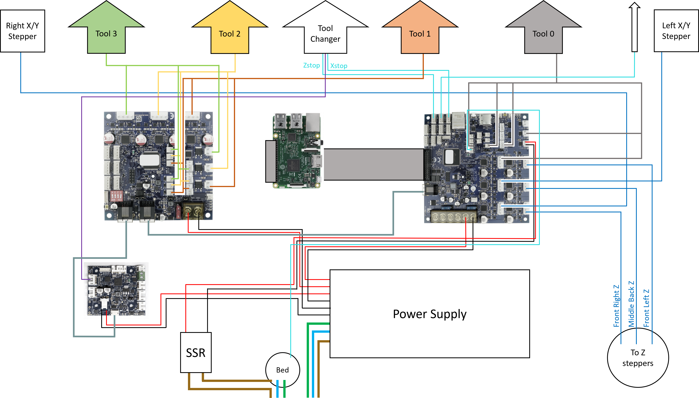

################################
Electronics and Wiring
################################

For the electronics, you will need to crimp your own connectors. We recommend adding quick connectors for the printheads, to make removing the printheads for maintenance easy. In this example, 5x2 DuPont connectors were used for everything but the heater wires, which use a MOLEX style connector. Assuming you have prepared all wires as in the "Crimped Wires" section under "Bill of Materials", please follow the guide below. 

.. Attention:: Wiring for the printer also requires some mains wiring. This should only be done by a certified electrician. The plans can be found at the end of this guide.

| To mount the electronics, first screw in 16 8mm spacers, holding them in place with m3 locking nuts. Mount the Duet3 boards as shown, using M3x6 screws. The Powersupply can be mounted using M4x8 screws, and the SSR can be mounted using M4x12 screws and M4 locking nuts. 

| 

| 

| 

----------------------------

| Plug in the ribbon cable on the Duet3 mainboard. Place the cable as shown. 

| 

| 

| 

----------------------------

| Mount the Raspberry Pi above it using four M3x6mm screws. Plug in the ribbon cable in the Raspberry Pi.

| 

| 

| 

----------------------------

| Insert zip ties as shown.

| 

| 

| 

----------------------------

.. Note:: For the following steps please refer to the wiring diagram.

| Connect the power wires for the three boards. Note the inline fuse in the live wire for the 1LC. 

| 

| 

| 

----------------------------

| Connect the CAN buses of the three boards.

|

| 

| 

| 

----------------------------

Connect the heater cable and thermistor for the heated bed and the extruders as shown in the wiring diagram. Lastly secure the wires using the zip ties.

Wiring Diagram
==============

   
Mains Wiring
==============
   
.. DANGER:: Mains voltage can be lethal and should only be handled by a certified electrician!

.. figure:: img/Elec8.pdf
   :figwidth: 600px
   :alt: Left floating image
   :align: left

.. DANGER:: Mains voltage can be lethal and should only be handled by a certified electrician!
