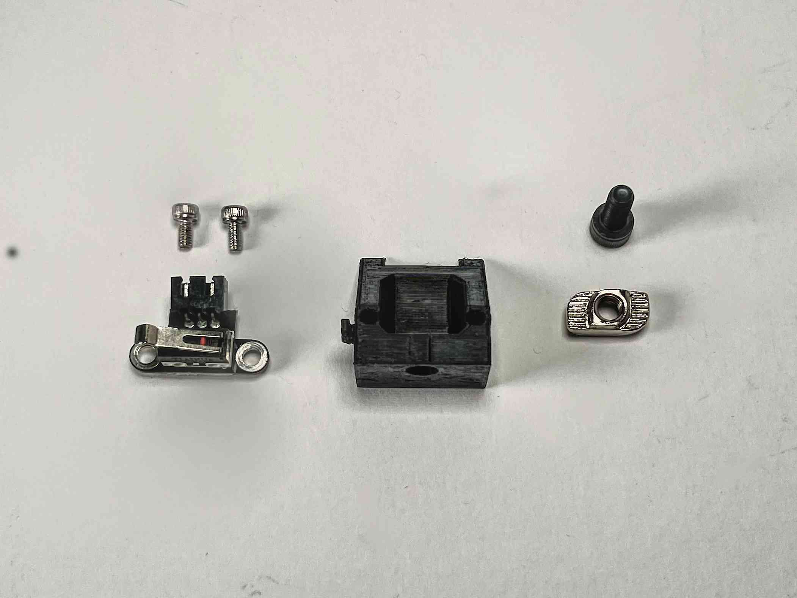
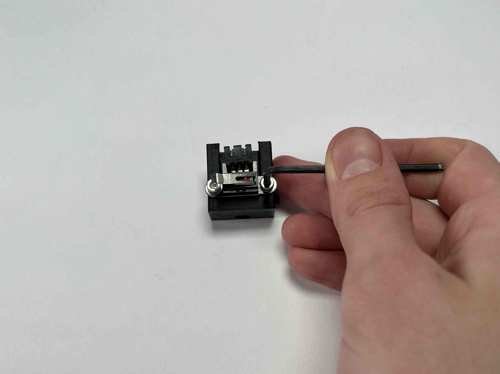
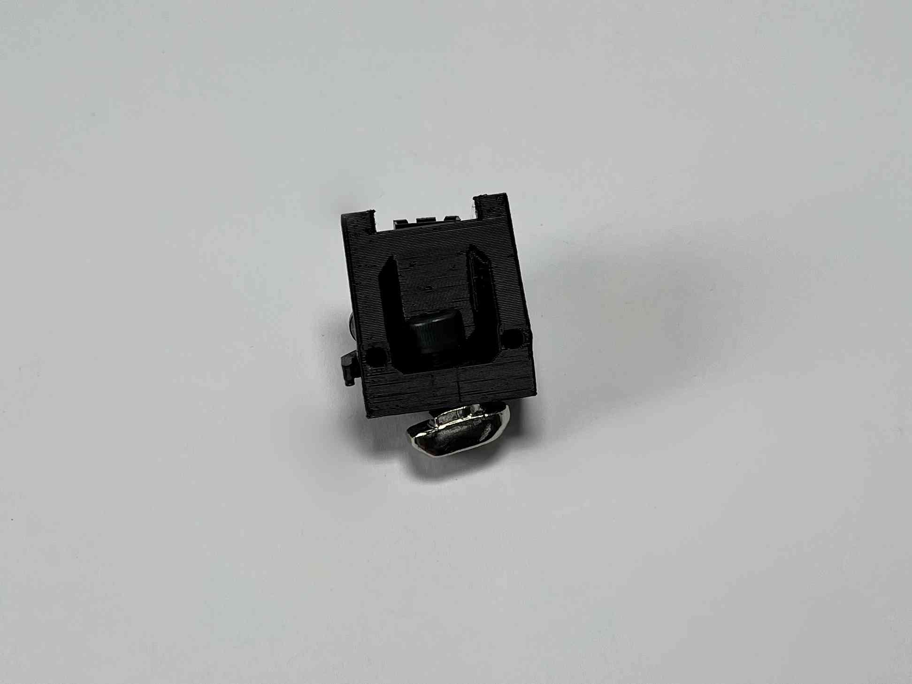
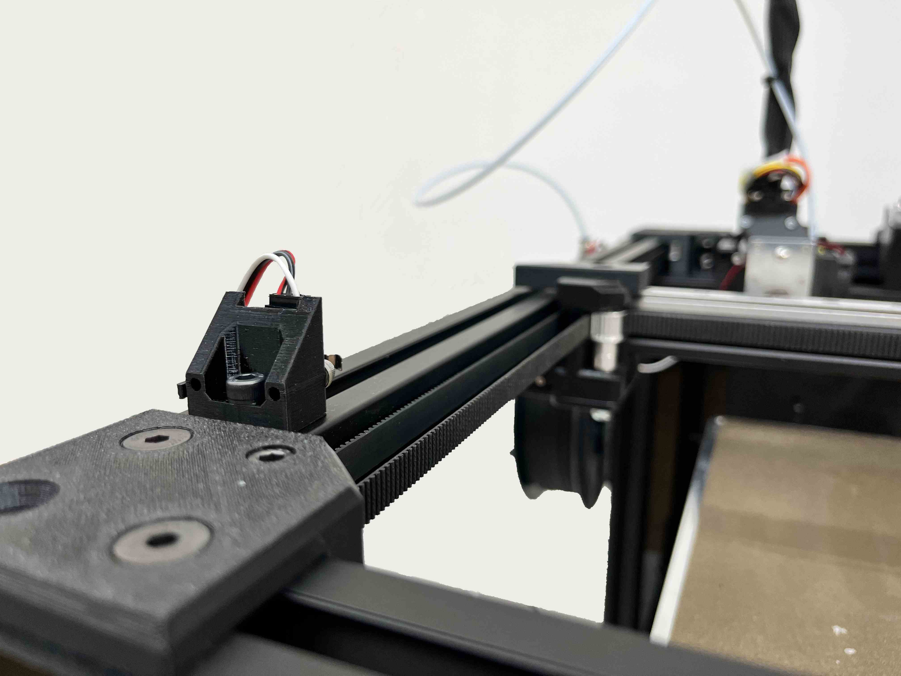

################################
Rat Rig
################################

To assemble the Rat Rig, please follow the instructions found `here <https://ratrig.dozuki.com/c/Rat_Rig_V-Core_3>`_ up to and with step 7 "Bed Assembly". Please note the following modifications:

- `Step 1.8 <https://ratrig.dozuki.com/Guide/01.+Frame+assembly/53?lang=en#s294>`_ (Optional) Inner frame panel: If you cut the electronics mounting in a single sheet of acrylic, it makes sense to mount it now. Otherwise working on the printer is easier without the panels installed and if it is split into two halves, it is easy to install later in the process. If you are installing it now, use four M5x12 caphead screws with M5 drop-in T-nuts for each panel or eight if it is a single sheet.
- `Step 1.16 <https://ratrig.dozuki.com/Guide/01.+Frame+assembly/53?lang=en#s497>`_ Assemble the Y endstop: The hydra uses a slightly modified version of the Y endstop. Please follow the guilde at the end of this section. You can do this after assembling the rest of the Rat Rig.

- `Step 1.17 <https://ratrig.dozuki.com/Guide/01.+Frame+assembly/53?lang=en#s302>`_ Attach the cable guide and Y endstop: Please use the modified cable guide, for which the STL was provided.
- `Step 6.13 <https://ratrig.dozuki.com/Guide/06.+X+gantry/76#s498>`_  X endstop block: The Hydra uses a slightly modified X endstop block. Please use this modified version, for which the STL was provided.

To attach the modified Y endstop, simply attach the microswitch to the modified 3D printed part using two M3x6 caphead screws.

| Prepare a microswitch, the "YstopHolder", two M3x6 caphead screws, one M6 drop in T-nut, and one M6x12 caphead screw.

| 

| 

| 

----------------------------

| Attach the microswitch to the YstopHolder using two M3x6 caphead screws.

|

| 

| 

| 

----------------------------

| Attach the drop in T-nut to the part using the M6x12 screw.

|

| 

| 

| 

----------------------------

| Attach the the part to the left part of the frame, making sure it is pushed up all the way to the plastic corner piece.

| 

| 

| 

----------------------------

Confirm that the switch is activated, just before the Y axis is stopped by the metal brackets on the low end of the printer. 
