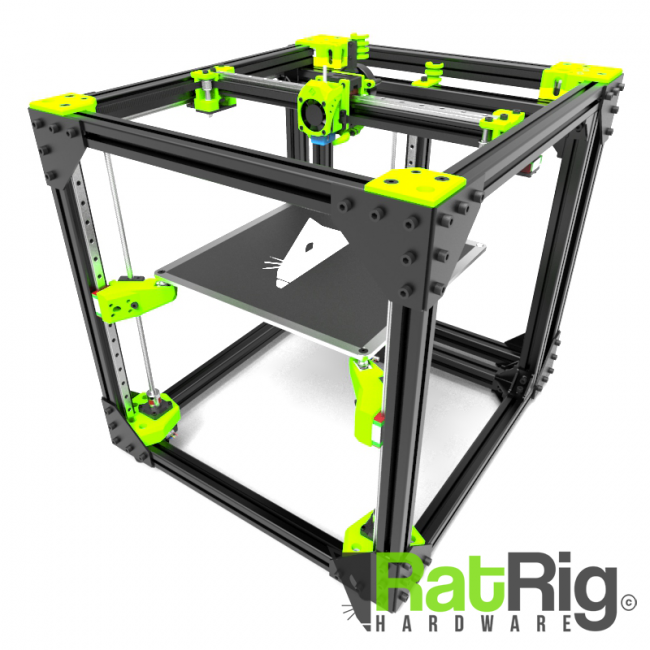
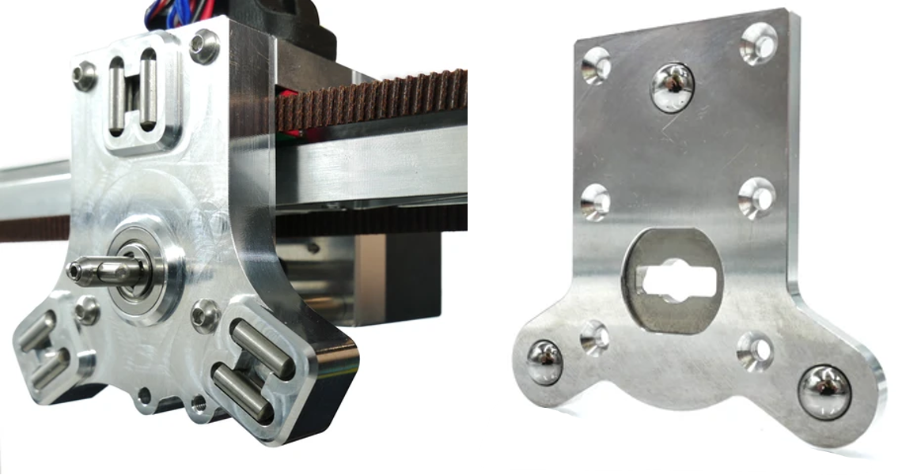

################################
Components
################################

The Hydra MK1 is built on the basis of several open-source projects and products that are noted below:

Motion system and Toolchanger
============

The motion system of the printer is built upon the **Rat Rig V-Core 3** by `Rat Rig Lda. <https://www.ratrig.com/>`_  (From this point on referred to as Rat Rig). This is a `core XY <https://corexy.com/theory.html>`_ system with three independent Z-axis motors. This makes it perfect for tool swapping since the print head only moves in the Xy- while not moving in Z-direction. Additionally, the independent Z-motors make levelling the print platform completely automatic. For the Hydra MK1, the 400mm x 400mm x 400mm build volume was chosen. While this could be substituted for the 500mm version, the 300mm version offers too little space in the back to park the tools.

    The default Rat Rig V-core 3 System (Source: www.ratrig.com)

Mounted on the tool head of the Rat Rig is the **E3D tool changer** by `E3D <https://e3d-online.com/pages/toolchanger>`_ . It uses a three groove kinematic coupling, where three steel balls are located in V-slots or between two rods, to create a repeatable mechanical coupling. This mechanism is held in place by a rotating shaft, that can interlock with the receiving tool plates.

    The E3D tool changer (left) and the receiving plate (right). (Source: e3d-online.com)

The system runs on the **Duet 3 Mainboard 6HC** by `Duet3D <https://www.duet3d.com/>`_ that is connected to a `Raspberry Pi <https://www.raspberrypi.com/>`_ 3B  running DuetPi. This makes the controls of the printer easily accessible and maintainable through a web interface. To control additional printheads a Duet 3 Expansion 3HC and a Duet 3 Toolboard are used.

Printheads
=============

The standard configuration of the Hydra MK1 features two **Hemeras** by `E3D <https://e3d-online.com/products/e3d-hemera-direct-kit-1-75mm>`_ and two **V4 Pellet Extruders** by `Mahor XYZ <https://mahor.xyz/producto/v4-pellet-extruder/>`_ . The tools can be mounted to the tool head via the tool changing system by E3D. While the E3D Hemera offers reliable 3D printing of various filaments, the Pellet Extruders make it possible to quickly prototype new materials and print materials that are not viable for filament production such as materials with shore hardness below 60A.

.. figure:: img/Extruders.png
    :align: center
    :figwidth: 400px
    
    The Hemera extruder (left) and the V4 pellet extruder (right). (Source: e3d-online.com \& mahor.xyz)
    

