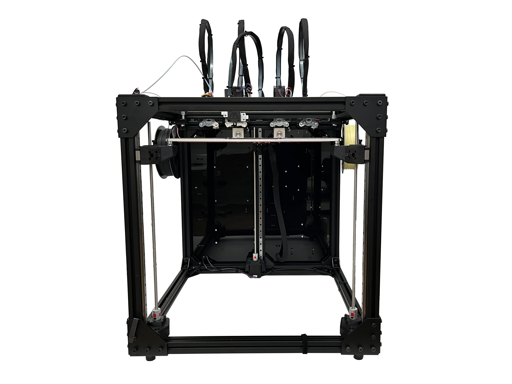

################################
What is a Hydra MK 1?
################################

The Hydra MK1 is an open-source project that aims to bring multi-material printing of exotic materials to research facilities and individuals worldwide. It features a tool swapper that can switch between up to four tools. In the standard configuration, it uses two filament printing heads, as well as two pellet extruders.

    The Hydra MK1 Standard Configuration
