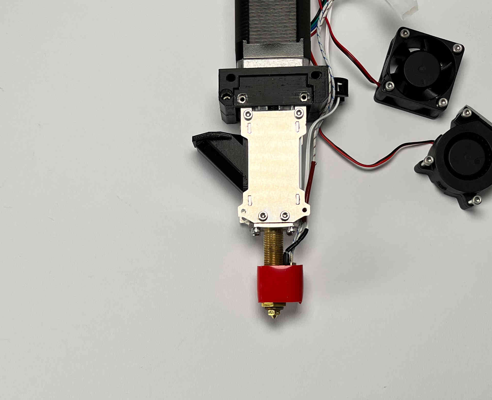
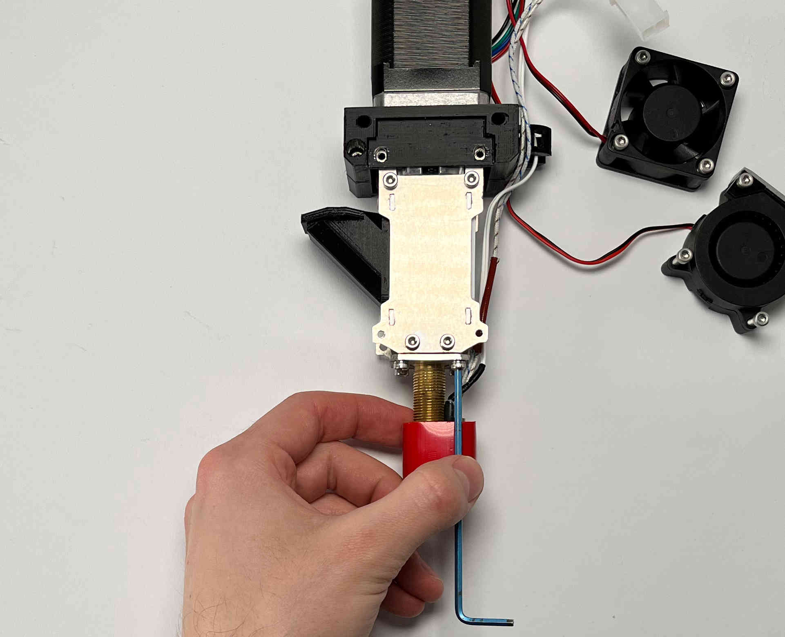
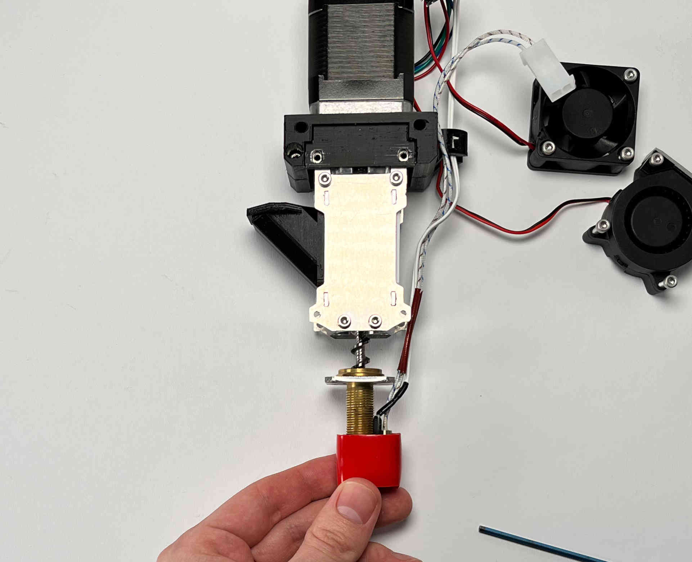

################################
Unclogging Pellet Extruder
################################

To unclogg the V4 Pellet Extruder please follow the assembly guide in reverse order, until both aluminium brackets are removed. The Extruder should now look like this:

Now unscrew the four M3 bolts holding the small aluminium plate around the main brass tube.

    
After removing the tube you should be able to slide the brass tube off of the extruder screw.

    
Be careful to not damage the heatcartridge and/or the thermistor. When you have to excert larger forces to remove the clogg, it could make sense to remove the heating block, to prevent damage.
