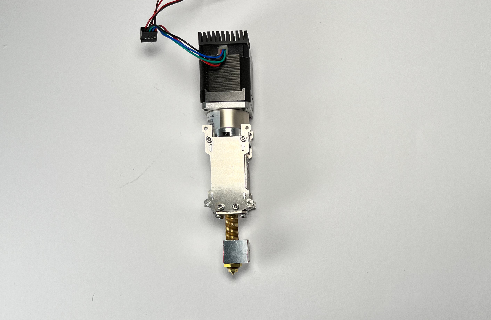
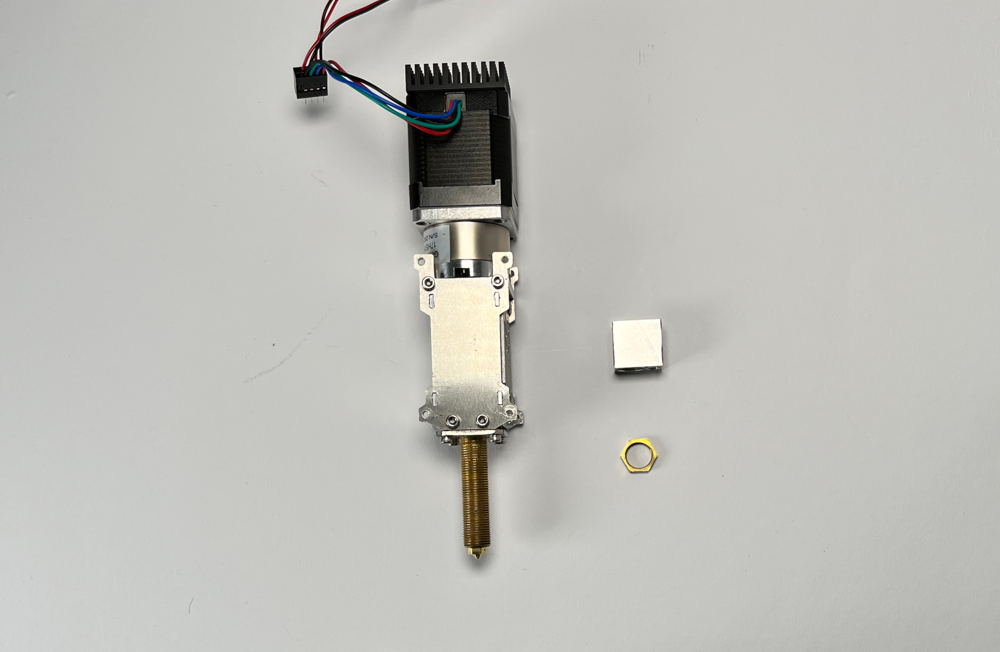
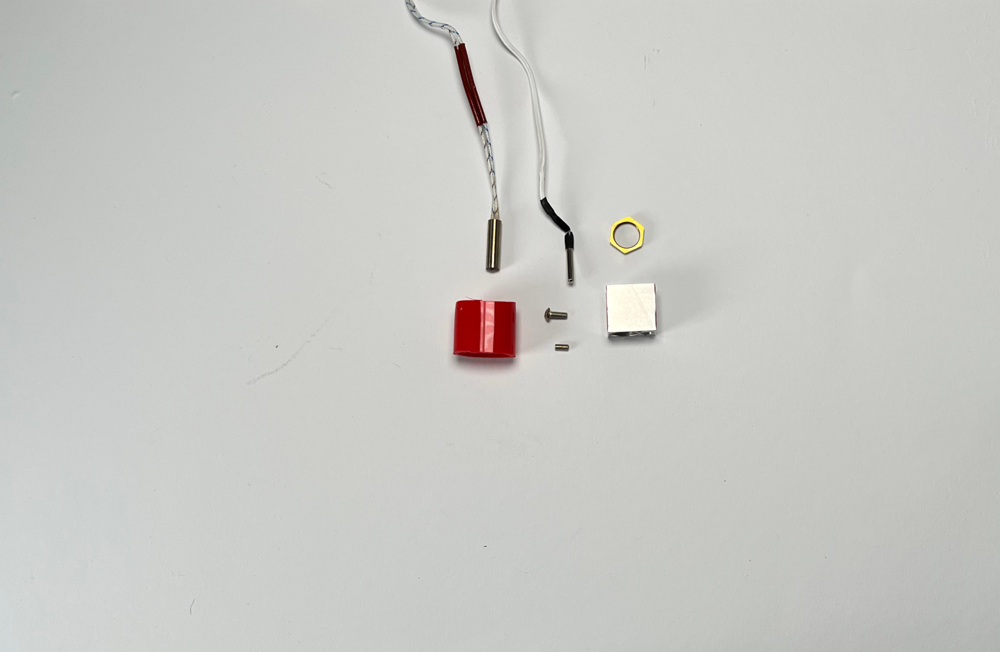
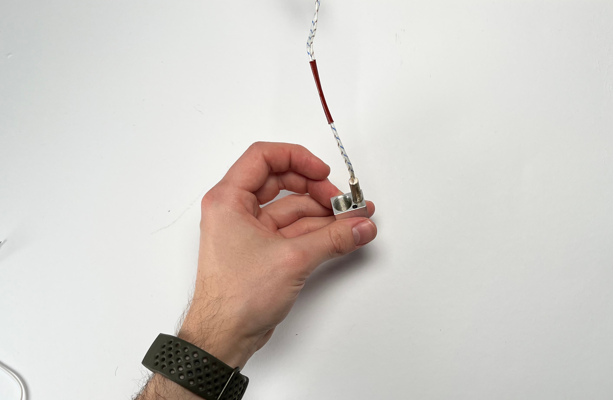

################################
Pellet Extruder V4
################################

In case your pellet extruder came preassembled please disassemble it until it looks like the one in this image. This can be done intuitively or by following several steps of this build guide backwards.

   
Heating Element
===============

|\   Prepare the heat cartridge, the thermistor and the silicone tube

| 

| 

| 

----------------------------

| Remove the hex nut and the heater block from the hot end

| 

| 

| 

----------------------------

| Insert the heat cartridge

| 

| 

| 

----------------------------

•	Carefully clamp the heat cartridge using a SIZE screw
•	Insert the thermistor (It makes sense to check the thermistor by mearing its resistance. It should be around VALUE)
•	Carefully clamp the thermistor
•	Reinstall the heating block and hex nut on the hotend
•	Add the silicone tube around the heater block

•	Prepare the printed part “pellet_parking”, the machined part “pellet_bracket”, two pins from the E3D Toolchanger, two M3 locking nuts, two M3 x LENGTH screws, and one M3 x 5 screw, magnet.
•	Screw the two pins into the pellet_bracket. If the fit is too tight carefully loosen up the outer hole with a 4mm drill bit.
•	Insert two M3 locking nuts into the pellet_parking part
•	Tighten the pellet_bracket to the pellet_parking part using the two M3 x LENGTH screws.
•	Carefully tap an M3 thread into the plastic part using the M3 x 5 screw.
•	Push in the magnet until it is up against the outer plastig holding it in place.

•	Prepare two M3 locking nuts, two M3 LENGTH screw, one M3 x 5 screw, and the two parts of the “pellet_receiver”.
•	Insert one M3 locking nut into each of the two pieces of the “pellet_receiver” part.
•	Place both parts upside down on a flat surface and join them using two M3 LENGTH screws
•	Using a 4mm drill bit carefully widen the receiver holes for the pins. Constantly check the fit using the already assembled parking spot
•	Carefully tap an M3 thread into the plastic part using the M3 x 5 screw.
•	Unscrew the two parts

•	Prepare the two parts of the “pellet_receiver”, the “pellet_fan_grate”, the “pellet_guide”, the cut and predrilled steel strip, and the two outer aluminium brackets of the pellet head including the screws, that held it down.
•	Place the “pellet_bracket_A” (the one with the cable brace) on the side of the extruder. Please note the orientation of the extruder, with the opening for the pellets facing to the right, and the heater cables to the left.
•	Place one of the outer aluminium brackets on top of the pellet_bracket_A
•	Place the steel strip on top of the aluminium bracket
•	Insert the M3 screws. Do not tighten yet
•	Insert two aluminium spacers and the other two M3 screws. Do not tighten yet.
•	Push the pellet_bracket_A all the way up against the motor and tighten down the two upper M3 screws. This is essential for a good fit with the parking spot once installed on the printer.
•	Tighten the other two screws.
•	Turn the extruder around.
•	Place the “pellet_bracket_B” on the extruder.
•	Place the other outer aluminium brackets on top of the pellet_bracket_B. Make sure the cables are guided inside of the lower part of the aluminium bracket.
•	Insert the M3 standoffs. Do not tighten yet
•	Insert two aluminium spacers and the other two M3 standoffs. Do not tighten yet.
•	Push the pellet_bracket_B all the way up against the motor and tighten down the two upper M3 standoffs. (TIP: if you don’t have a wrench handy, insert a short M3 screw into the standoffs and use it to tighten them down.)
•	Tighten the other two standoffs.
•	Note: there should be no gap between the motor and the bracket.
•	Remove the aluminium grate from the pellet extruder
•	Add the “pellet_fan_grate” using the screws you just removed
•	Fasten the “pellet_guide” on the other side

•	Prepare the “pellet_fan_shroud”, the “pellet_fan_guide”, the two fans, and seven M3 LENGTH screws.
•	Insert the “pellet_fan_shroud” into the turbo/print fan.
•	Fasten the print fan to the extruder using 3 M3 LENGTH screws.
•	Take the “pellet_fan_guide” and rout the print fan cable and hot end cables through the notches.
•	Place the fan guide on the extruder making sure the cable is facing upwards
•	Place the fan on the fan guide and fasten using 4 M3 LENGTH screws.

•	Prepare the “pellet_plate”, the M3 screw that were inserted into the standoffs, and the E3D Toolplate including its 6 mounting screws.
•	Tap into the plastic part using an M3 screw. (We recommend to use a caphead screw to this to avoid damaging the screw/allen key)
•	Insert the M3 screws from the pellet extruder in the pellet_plate
•	Place the toolplate on the pellet_plate and fasten it using the tapped holes and screws provided by E3D.
•	Fasten the plates onto the extruder using the standoffs. 

.. rst-class::  clear-both

.. figure:: img/Extruders.png
   :figwidth: 300px
   :alt: Left floating image
   :class: with-shadow float-left

Some text ... (will be displayed on the right of the image)

.. rst-class::  clear-both

