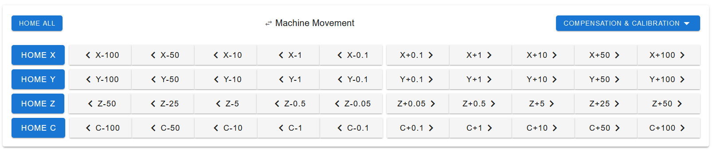

################################
Homing
################################

Before homing, no tool should be selected. If a tool is selected make sure to home the C axis first, while holding the currently selected Tool. The tool will release and can manually be slid back into its parking spot.

To home the printer simply press the button "Home all" in the Duet web interface. Alternatively all axis can be homed using the `G28 <https://duet3d.dozuki.com/Wiki/G28>`_ command. To home a single axis, press the respective home button in the Duet web interface.

To level the bed run the `G32 <https://duet3d.dozuki.com/Wiki/G32>`_ command. This will probe three points and then adjust the bed, compensating for any tilt. It is recommended to run this process at least twice. 

.. DANGER:: Make sure to manually level the bed by eye before running the G32 command. If an offset larger than 5mm is present, the Toolhead might crash into the print bed.

To run a mesh bed calibration use the command `G29 <https://duet3d.dozuki.com/Wiki/G29>`_ S0. This will probe the bed in a 5x5 grid, store the data in the heightmap.csv file, and compensate for any skews in the printing platform.

    The Home Buttons in the Duet Web Interface
