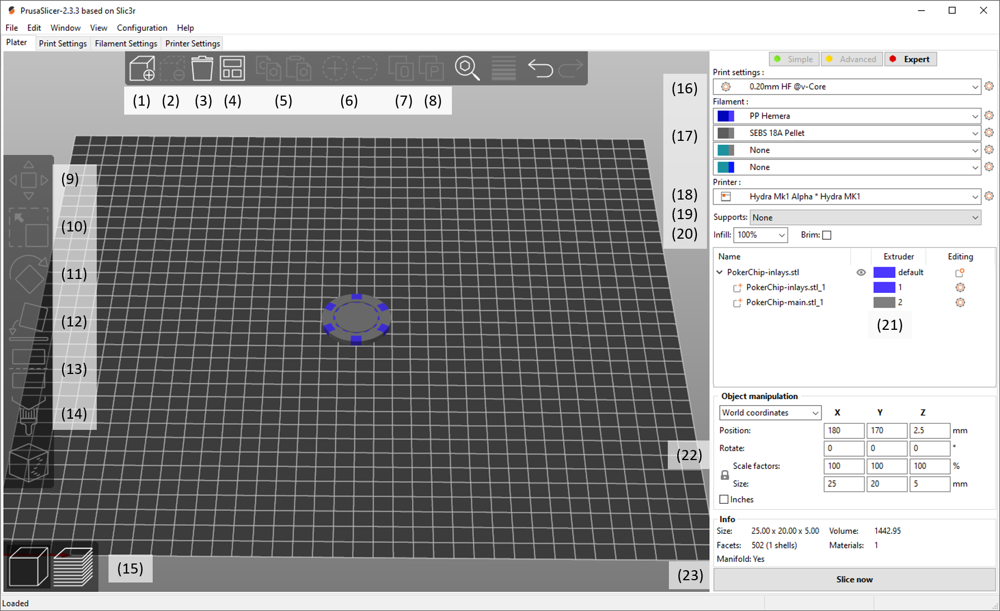

################################
Slicing and Printing
################################

Open PrusaSlicer and make sure the Hydra MK1 profile is selected on the right (18). Import your model by either draging it into the PrusaSlicerwindow from WindowsExplorer/Finder or clicking the "Add..." Button in the interface (1). you can remove any single model at anytime by pressing the "Delete" button (2) or remove all models by pressing the "Delete all" button (3). You can also copy and paste a model using the buttons in the interface (5) or create/remove instances of an object (6). If your STL consists of multiple objects, you can either split them into objects (7) or parts (8). Objects can be moved independent from one another, while objects stay connected, but can have separate printing parameters.

To position your object you can either use the coordinate window in the bottom right (22) or the move (9), scale (10), rotate (11); and "lay on face" (12) tools in the sidebar. You can also split your models along the Z-axis (13) to print them in two parts. 

Select a layer height using the drop-downmenu (16).

Select what material is loaded into the different tools (17). If you are not using the tool for the current print, set the material to "none" to avoid preheating the extruder. You can set the material for each object using the dropdown menu (21). You can also define different materials for different regions of the model, by right-clicking on an object and adding a height range modifier.

If you are using supports you can activate them in the dropdown menu (19). You can either use the autogenerated supports or specify where supports are to be placed, by creating support enforcer blocks (Right-click -> add support enforcer) or by painting on supports using the tool from the sidebar (14).

Select the required infill from the dropdown menu (20) or directly input a value.

If you are using soluble supports navigate to the "Print Settings" tab and select the "Multiple Extruders" settings. There select the extruder to be used under "Support material/raft/skirt extruder" and "Support material/raft interface extruder". A value of 0 means no specific extruder will be used for support material.

In the "multiple Extruders" settings you can also select to use a wipe tower. Simply activate it by hitting the checkbox under "Enable". Changing back to the "Plater" tab you can then position the wipe tower. Its size will adapt after you slice your model for the first time.

    The Main Prusa Slicer Window

If you are satisfied with your settings press "Slice now"(23) and double-check the generated gcode. You can switch back and forth between object placement and generated gcode via the two buttons in the bottom left (15). Make sure the correct materials are loaded in the extruders, then you can directly upload the gcode to the printer using the right button that replaces the "Slice now" button. 
